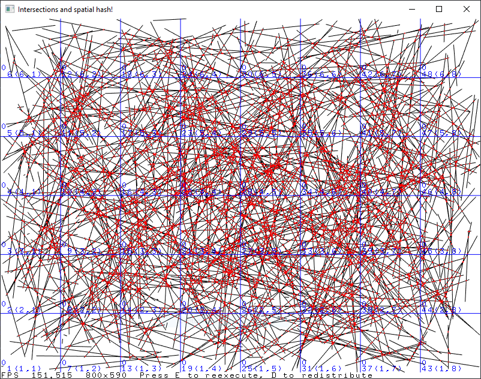

# Trabalho 2 - Spatial Hashing

## Compilação

Em ambiente MSYS2:

    $ make

Não configurado em outros ambientes.

## Design e funcionamento

Pixels é a unidade de medida.

## Controles

Instruções dentro da aplicação.

## Contratos

### Contrato: distribuição de segmentos

- [X] Definir área de distribuição
- [X] Distribuir segmentos com tamanho e ângulo aleatório

### Contrato: intersecção

- [X] Implementar intersecção de segmento com segmento
- [ ] Implementar detecção de segmentos colineares
- [X] Buscar intersecção de todos com todos segmentos
- [X] Buscar intersecção dos segmentos usando spatial hash

### Contrato: spatial hash

- [X] Hash de linha resultando em múltiplas células
- [X] Anotar de uso e presença em células
- [X] Distribuir da tabela crua como matriz e índices finais
- [X] Armazenar dos objetos na tabela
- [ ] Estimativa exata do tamanho da tabela

### Contrato: visualização

- [X] Mostrar segmentos
- [X] Mostrar células do spatial hash
- [X] Mostrar pontos de intersecção
- [X] Mostrar resultados parcialmente
- [ ] Variar visualização parcial conforme parâmetros
- [ ] Zoom
- [ ] Variar resultados visualizados conforme zoom
- [X] Aceitar redimensionamento da janela durante execução

### Contrato: desempenho

- [ ] Medir tempo de execução
- [ ] Desconsiderar tempo de renderização
- [ ] Desconsiderar tempo de geração de segmentos
- [ ] Somar opcionalmente tempo do hash espacial

### Contrato: parametrização

- [ ] Parametrizar quantidade de segmentos em tempo de execução
- [ ] Parametrizar tamanho das células

### Contrato: controles

- [ ] Execução por passos
- [ ] Regulagem automática de passos
- [ ] Pausa da execução
- [ ] Interrupção da execução

### Contrato: estatísticas 

- [ ] Histórico de execuções

## Restrições

- Não ultrapassar 1800x1000 pixels o tamanho da tela
- Quantidade de segmentos na escala de centenas de milhares e milhões
- Manter 200 FPS, se possível
